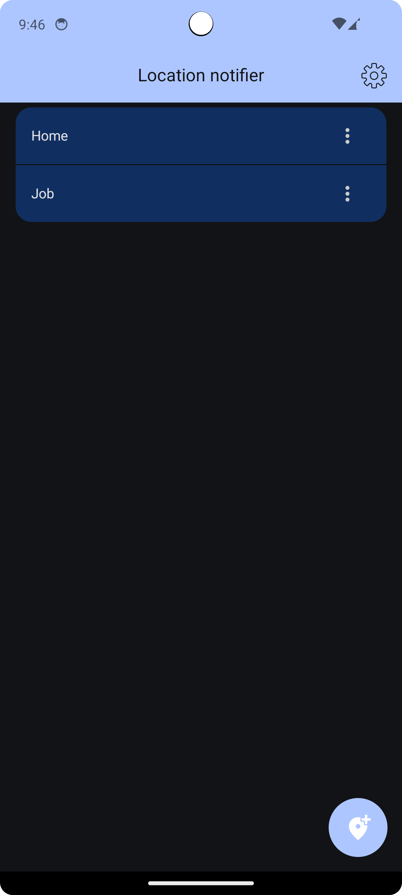
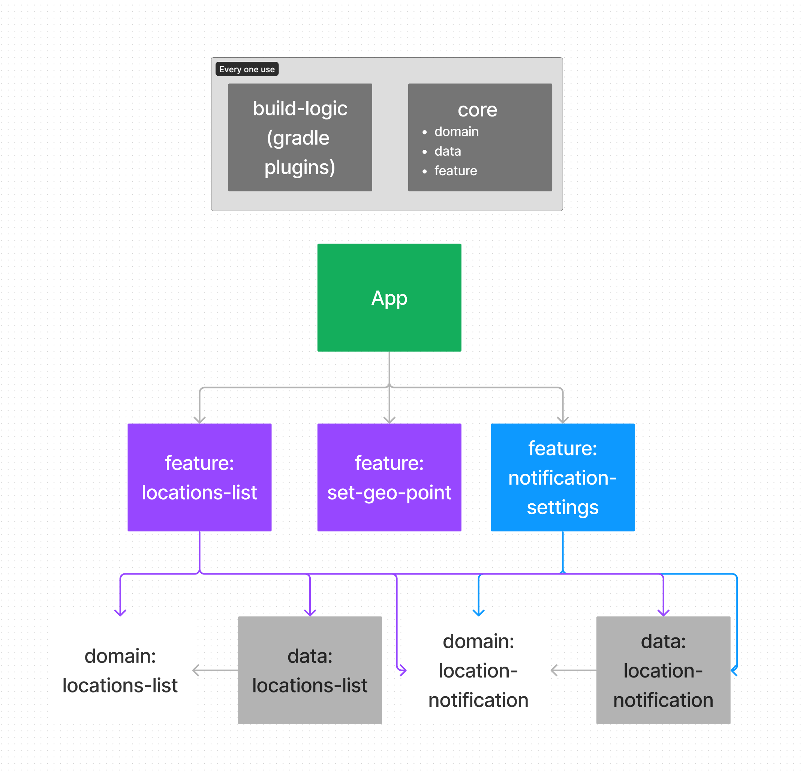

# Location notifier
> Приложение, которое оповещает при достижении указанной точки на карте

## Скриншоты

## Stack
### Architecture

- Clean architecture
- MVI
- Multi modules

### UI

- Jetpack Compose
- Jetpack Navigation

### DI

- Dagger 2

### **Asynchrony**

- Coroutines
- Flow

### Database

- Room

### Location

- OSMdroid
- Google location service

## Архитекутар модулей

